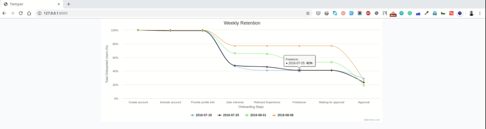

# Temper PHP Assessment

This project is proving a solution to Temper to get an idea of how users are performing in the Onboarding Flow

## Server Requirements

- PHP >= 7.1.3
- BCMath PHP Extension
- Ctype PHP Extension
- JSON PHP Extension
- Mbstring PHP Extension
- OpenSSL PHP Extension
- PDO PHP Extension
- Tokenizer PHP Extension
- XML PHP Extension
 
## Setup Instructions

1. Download or clone the repository
2. Rename .env.example as **.env**
3. Run `composer update`
4. Run `php artisan key:generate`
5. Run `php artisan serve`

## Screenshot

